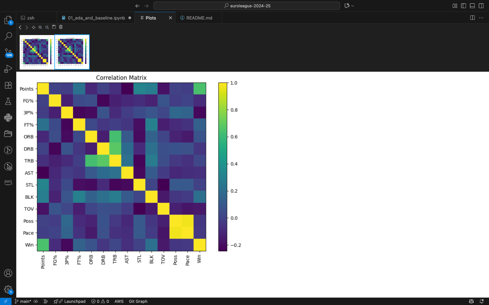
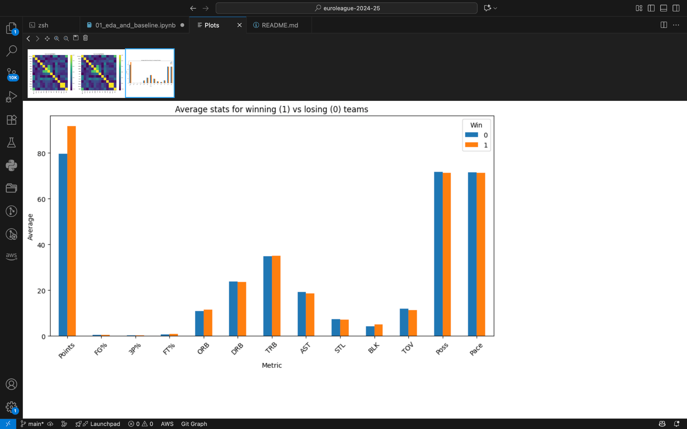
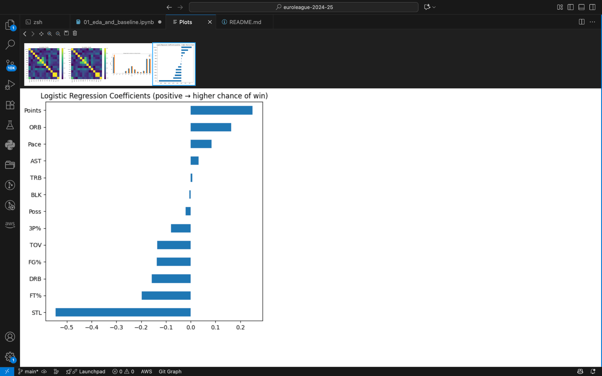
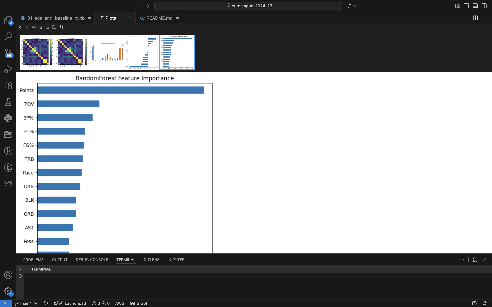

# EuroLeague 2024–25: Team-Level Basketball Analysis 🏀


## Project Goal

Analyze team-level statistics from each game of the EuroLeague 2024–25 season and identify which metrics most influence winning.

This project currently uses a **dummy dataset** (~30 games, synthetic) to build the pipeline. The same structure will later be applied to real EuroLeague data.

## Repository Structure

```
euroleague-2024-25/
├── data/
│   ├── raw/                # raw datasets (dummy or real)
│   └── processed/          # cleaned datasets ready for analysis
├── notebooks/
│   └── 01_eda_and_baseline.ipynb   # Jupyter notebook with analysis
├── src/                    # optional python scripts
├── outputs/
│   └── charts/             # generated charts and figures
└── models/                 # trained models (future)
```

## Steps Performed

1. **Data Loading & Inspection**

   - Load team-level per-game stats (Points, FG%, 3P%, FT%, Rebounds, Assists, Turnovers, etc.)
   - Inspect structure and summary statistics
2. **Exploratory Data Analysis (EDA)**

   - Compare winning vs losing teams across metrics
   - Correlation matrix of stats with outcome (Win/Loss)
3. **Baseline Model**

   - Logistic Regression to predict Win/Loss
   - Evaluation: confusion matrix, classification report, ROC AUC
   - Feature importance via logistic coefficients

## Example Outputs

### Correlation Matrix



### Average Stats (Win vs Loss)



### Logistic Regression Coefficients




## Results & Interpretation

- Higher FG% and rebounds increase winning probability
- Turnovers decrease probability of winning
- Dummy data confirms pipeline works and is ready for real EuroLeague data

### Model Comparison

- Baseline: Logistic Regression (dummy data)
- Upgrade: RandomForest (often stronger on tabular data)
- Findings: shooting efficiency (FG%) and rebounding tend to increase win probability; turnovers reduce it (to be validated on real data).



## Next Steps

- Replace dummy dataset with **real EuroLeague 2024–25 stats**
- Experiment with stronger models (RandomForest, GradientBoosting)
- Build an interactive dashboard (Streamlit/Plotly)
- Expand to player-level or play-by-play data

## Requirements

- Python 3.9+
- Install requirements:

```bash
pip install -r requirements.txt
```

## License

This project is licensed under the MIT License - see the [LICENSE](LICENSE) file for details.

## Author

Developed as part of a sports analytics portfolio.
